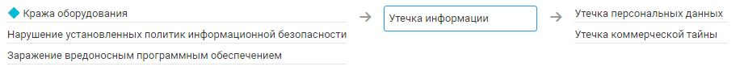

# Утечка информации

## Описание угрозы
Общая угроза связанная с утечкой, компрометацией, кражей, разглашением информации, специальной (умышленной) или случайной. Вне зависимости от характера и конфиденциальности информации.
Частные случаи, в зависимости от вида скомпрометированной информации, рассмотрены в других угрозах, являющихся следствием реализации текущей.

### Нарушение КЦД
+ Конфиденциальность 

## Источники угрозы, уязвимости и меры защиты
|Источники угрозы|
|-|
|Внешний нарушитель - Низкий потенциал|
|Внутренний нарушитель - Низкий потенциал|

|Уязвимость|
|--------|
|[Возможность атаки Man in the Browser](/vkr/vulnerabilities/page15)|
|[Возможность доступа к некорпоративным облачным хранилищам](/vkr/vulnerabilities/page16)|
|[Возможность удаленно выполнить захват аудио или видеопотока](/vkr/vulnerabilities/page17)|

|Меры защиты|
|--------|
||

### Цепочка угроз
