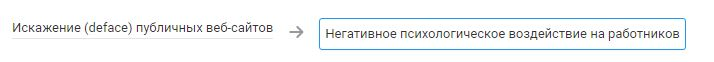

# Искажение (deface) публичных веб-сайтов

## Описание угрозы
Deface (уродовать, искажать) - тип хакерской атаки, при которой главная (или другая важная) страница веб-сайта заменяется на другую — как правило, вызывающего вида (реклама, предупреждение, угроза).
Deface публичных веб-сайтов может быть использован для запуска цепочки событий или в качестве ответа на действия, предпринятые организацией или правительством. Целью так же может быть попытка запугать или иным образом ввести в заблуждение организацию или пользователей.
Для реализации дефейса нужен доступ к веб серверу или панели администрирования веб-сайта.

### Нарушение КЦД
+ Конфиденциальность

### Объекты атаки:
+ Веб-сайт

## Источники угрозы, уязвимости и меры защиты
|Источники угрозы|
|-|
|Внешний нарушитель - Низкий потенциал|
|Внутренний нарушитель - Низкий потенциал|

|Уязвимость|
|--------|
|[Реагирование на мошеннические, фишинговые письма и сообщения](/vkr/vulnerabilities/page1)|
|[Публикация информации в открытых источниках](/vkr/vulnerabilities/page4)|
|[Возможность приобретения ранее скомпрометированной информации](/vkr/vulnerabilities/page5)|
|[Увольнение ответственного за актив работника](/vkr/vulnerabilities/page25)|
|[Возможность подбора пароля путем перебора (bruteforce)](/vkr/vulnerabilities/page26)|
[Появление поддельных публичных ресурсов от имени компании](/vkr/vulnerabilities/page27)|

|Меры защиты|
|--------|
|[Добавление предупреждений к письмам от внешних отправителей](/vkr/measures/page5)|
|[Ограничение (блокировка) доступа к некорпоративным облачным сервисам](/vkr/measures/page13)|
|[Блокировка доступа к несанкционированным сетевым папкам в локальной сети](/vkr/measures/page14)|
|[Ведение реестра информационных активов](/vkr/measures/page19)|
|[Настройка безопасных заголовков для web сайта](/vkr/measures/page34)|
|[Привязка представительств в социальных сетях к корпоративным учетным записям](/vkr/measures/page37)|

### Цепочка угроз

## Вхождение в базы ФСТЭК, MITRE ATT&CK
### Техники MITRE ATT&CK:
+ [T1491.002 Defacement: External Defacement](https://attack.mitre.org/techniques/T1491/002/)