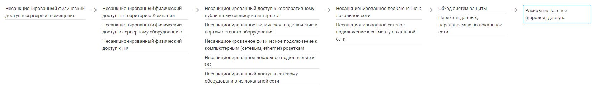

# Раскрытие ключей (паролей) доступа

### Нарушение КЦД
+ Конфиденциальность

## Источники угрозы, уязвимости и меры защиты
|Источники угрозы|
|-|
|Внешний нарушитель - Низкий потенциал|
|Внутренний нарушитель - Низкий потенциал|

|Уязвимость|
|--------|
|[Реагирование на мошеннические, фишинговые письма и сообщения](/vkr/vulnerabilities/page1)|
|[Наличие учетных записей с неограниченным сроком действия пароля]((/vkr/vulnerabilities/page2))|

|Меры защиты|
|--------|
|[Обнаружение учетных записей Active Directory с неограниченным сроком действия пароля](/vkr/measures/page3)|
|[Контроль целостности файла hosts](/vkr/measures/page4)|
|[Добавление предупреждений к письмам от внешних отправителей](/vkr/measures/page5)|
|[Централизация системы антивирусной защиты (АВЗ)](/vkr/measures/page6)|
|[Перевод доменной аутентификации на Kerberos (отключение NTLM)](/vkr/measures/page10)|
|[Блокировка доступа к несанкционированным сетевым папкам в локальной сети](/vkr/measures/page14)|
|[Настройка безопасных заголовков для web сайта](/vkr/measures/page34)|

### Цепочка угроз
