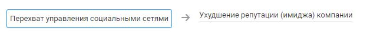

# Перехват управления социальными сетями

## Описание угрозы
Получение несанкционированного доступа к представительствам компании в социальных сетях и мессенджерах (паблики, группы, страницы, аккаунты) позволяет злоумышленнику заблокировать легальный доступ (сменить пароли), внести изменения в контент, нанеся репутационный ущерб компании или удалить представительство.

### Нарушение КЦД
+ Целостность
+ Доступность

## Источники угрозы, уязвимости и меры защиты
|Источники угрозы|
|-|
|Внешний нарушитель - Низкий потенциал|
|Внутренний нарушитель - Низкий потенциал|

|Уязвимость|
|--------|
[Увольнение ответственного за актив работника](/vkr/vulnerabilities/page25)|
|[Возможность подбора пароля путем перебора (bruteforce)](/vkr/vulnerabilities/page26)|

|Меры защиты|
|--------|
||

### Цепочка угроз

