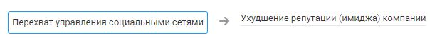

# Ухудшение репутации (имиджа) компании

## Описание угрозы
Негативное отношение к компании со стороны клиентов, партнёров, инвесторов, потенциальных и действующих работников.

|Источники угрозы|Уязвимость|
|-|--------|
|Внешний нарушитель - Низкий потенциал|[Появление поддельных публичных ресурсов от имени компании](/vkr/vulnerabilities/page27)|

### Цепочка угроз

