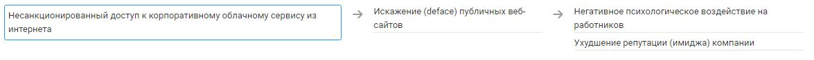

# Несанкционированный доступ к корпоративному облачному сервису из интернета
Примечание: Следует формировать отдельную угрозу для каждого  облачного сервиса и оценивать базовый ущерб исходя из критичности сервиса/представленной в нем информации

### Объекты атаки:
+ Облачный сервис

## Источники угрозы, уязвимости и меры защиты
|Источники угрозы|
|-|
|Внешний нарушитель - Низкий потенциал |

|Уязвимость|
|--------|
|[Наличие технических (программных) уязвимостей](/vkr/vulnerabilities/page6)|
|[Отсутствие проверки электронной почты при регистрации пользователя](/vkr/vulnerabilities/page7)|

|Меры защиты|
|--------|
|[Уведомление пользователей о предстоящей смене пароля](/vkr/measures/page48)|

### Цепочка угроз

