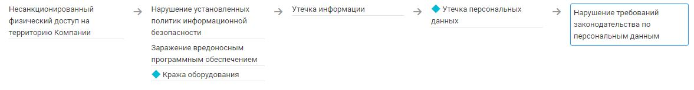

# Нарушение требований законодательства по персональным данным

Требования к обработке и защите персональных данных определены в [ФЗ от 27.07.2006 № 152-ФЗ "О персональных данных"](https://base.garant.ru/12148567/) и подзаконных актах.

### Нарушение КЦД
+ Конфиденциальность

## Источники угрозы, уязвимости и меры защиты
|Источники угрозы|
|-|
|Внешний нарушитель - Низкий потенциал|
|Внутренний нарушитель - Низкий потенциал|

|Уязвимость|
|--------|
|[Отсутствие соглашений (обязательств) о конфиденциальности](/vkr/vulnerabilities/page8)|
|[Отсутствие регламентированных обязанностей](/vkr/vulnerabilities/page9)|

|Меры защиты|
|--------|
|[Разработка Политики обработки персональных данных](/vkr/measures/page25)|
|[Публикация Политики обработки персональных данных на сайте](/vkr/measures/page26)|
|[Утверждение формы Акта об уничтожении персональных данных](/vkr/measures/page27)|
|[Проведение периодического уничтожения персональных данных](/vkr/measures/page28)|
|[Утверждение Акта оценки вреда, который может быть причинен субъектам персональных данных](/vkr/measures/page29)|
|[Утверждение приказа о назначении ответственного за организацию обработки персональных данных](/vkr/measures/page30)|
|[Подписание работниками обязательств о конфиденциальности](/vkr/measures/page39)|

### Цепочка угроз

